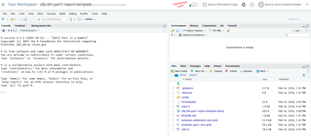
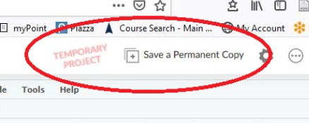

# RCloud Cheatsheet

This short guide shows you how to get everything ready to start using R in the cloud. No installations, no setup required!

By the end, you’ll have your own **RCloud workspace** (*think of it as your online R*) and a project that contains all the 
materials for this training.

You’ll be able to run R code directly in your browser, just like working in Word or Excel online.

-   🕒 Setup time: about 5–10 minutes

-   ✅ You only need to do this once: after that, you’ll be ready to jump straight into the training or create your own future projects.

----

1. Go to: https://posit.cloud/content/11921028 

    a.	If required, create a Free RCloud Account with your Google account (fastest option) or with your institutional email address, any email address will do :)

2.	After you login, you should see the following window:

  

 
3.	Click on the red “Save a Permanent Copy” item in the top bar to save the project to your workspace. Any changes that you make to the project (uploading files, creating scripts) will be saved in this project in your workspace. 
If you do not save a permanent copy, then any work that you do in the project will be lost when you come back to it.

  

4.	Create a **.env** file based on the envtemplate. For more details on this step (and the following one), you can refer to 
[this short video](https://www.youtube.com/watch?v=kUCeFa-auxg). In this step you will need access to a password for Tufman2 and Ikasavea. In case you don't have a T2 password yet, you can create one
by following [this other video](https://www.youtube.com/watch?v=MnKu-oQiuEY). 

5.	Source the main.R script to generate reports: Part 1, Addendum and Artisanal.

